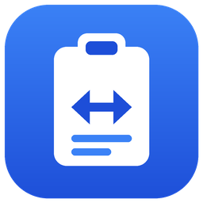

# Remote Clipboard

Portapapeles compartido, seguro y transparente entre computadores Windows de una red local.
Copias con **Ctrl+C** en un equipo y pegas con **Ctrl+V** en otro, también en Windows Server y
sesiones RDP.

> **Estado:** FASES 1, 2 y 4 completadas: sincronización cifrada de texto entre equipos vinculados de la
> LAN, descubrimiento automático, configuración e instalador con firewall automático.

## Características

- Texto plano Unicode: español, emojis, saltos de línea; textos largos (hasta 32 MiB por copia).
- Sincronización bidireccional automática entre equipos vinculados de la LAN.
- Vinculación explícita con código de 6 dígitos (J-PAKE, resistente a ataques offline).
- Cifrado TLS con autenticación mutua y pinning de clave pública.
- Prevención de bucles de sincronización (3 capas).
- Reconexión automática, ejecución en segundo plano, icono en la bandeja.
- Descubrimiento automático en la red local: al vincular eliges el equipo de una lista.
- Por dispositivo: enviar y recibir, solo enviar o solo recibir.
- Diseño *liquid glass* minimalista: superficies de vidrio translúcido, acrílico real de Windows 11
  (22H2+) y modo claro/oscuro que sigue a Windows.
- Privacidad: sin historial, sin nube, sin telemetría, **el contenido nunca se registra en logs**.

## Arquitectura

Un **agente por usuario** que se ejecuta en la sesión interactiva del usuario (también dentro de RDP),
sin privilegios de administrador. Detecta cambios con `AddClipboardFormatListener` (sin polling) y los
envía por **TCP + TLS mutuo** directamente a los dispositivos vinculados.

| Documento | Contenido |
|---|---|
| [docs/ARCHITECTURE.md](docs/ARCHITECTURE.md) | Stack, capas, portapapeles, Windows Server/RDP, anti-loops, instalación, testing, riesgos, decisiones pendientes |
| [docs/SECURITY.md](docs/SECURITY.md) | Modelo de amenazas, identidad, TLS con pins, protocolo de vinculación, secretos, privacidad |
| [docs/NETWORKING.md](docs/NETWORKING.md) | Puertos, firewall, topología, protocolo, reconexión, descubrimiento |
| [docs/TESTING.md](docs/TESTING.md) | Pruebas automáticas y plan de pruebas manuales con dos equipos |
| [docs/PRIVACY.md](docs/PRIVACY.md) | Política de privacidad |
| [docs/STORE.md](docs/STORE.md) | Publicación en la Microsoft Store (MSIX) |
| [docs/LICENSING.md](docs/LICENSING.md) | Prueba gratuita, claves de licencia sin conexión y cómo emitirlas |

## Requisitos y Windows compatibles

| Sistema | Soporte |
|---|---|
| Windows 10 / Windows 11 (x64) | Objetivo principal |
| Windows Server 2016 / 2019 / 2022 / 2025 (con Experiencia de escritorio) | Soportado (probado en servidor real) |
| Windows Server Core | No soportado (sin escritorio interactivo) |

El usuario final **no necesita instalar .NET** ni otras dependencias (publicación *self-contained*).

## Instalación y uso

**Prueba gratuita de 14 días**; después, la sincronización requiere una licencia (se activa en *Acerca de*,
sin conexión a Internet). Ver [docs/LICENSING.md](docs/LICENSING.md).

**Instalador listo para usar (de pago):** `RemoteClipboardSetup-vX.Y.Z.exe` se distribuye por el canal
de venta oficial (próximamente). Instala en *Archivos de programa*, crea los accesos directos y **configura
el firewall automáticamente** (solo redes privadas/dominio y subred local). Para actualizar, ejecuta el
instalador nuevo encima: se conservan la configuración y los dispositivos vinculados. Detalles en
[installer/README.md](installer/README.md). Comprarlo apoya el desarrollo.

**Microsoft Store:** versión empaquetada (MSIX) en preparación: firmada por Microsoft, con el firewall y el
inicio con Windows gestionados por Windows. Detalles en [docs/STORE.md](docs/STORE.md).

**Compilarlo tú mismo (gratis):** el código fuente completo de cada versión está en *Releases* (y en esta
rama). Con el .NET SDK 10 puedes compilar la app y el instalador como se explica en
[Desarrollo y compilación](#desarrollo-y-compilación) e [installer/README.md](installer/README.md).
La versión compilada por terceros no está firmada ni tiene soporte.

Configuración (barra lateral, icono ⚙ o menú de la bandeja): nombre visible, visibilidad en la red,
puerto, tema e inicio con Windows.

### Vinculación de dispositivos

1. En el equipo A: icono de la bandeja → **Vincular dispositivo…** → **Mostrar código** (p. ej. `847 291`,
   válido 2 minutos). La ventana también muestra la IP de A.
2. En el equipo B: **Vincular dispositivo…** → **Introducir código** → elegir A en **Equipos en la red**
   (o escribir su IP) + código → **Vincular**.
3. Listo: Ctrl+C en uno, Ctrl+V en el otro, en ambos sentidos. Se reconectan solos tras reinicios,
   cortes de red o cambios de IP.

Desde la bandeja: abrir la ventana, ver el estado, activar/desactivar la sincronización, iniciar con
Windows (activado por defecto en escritorio; opcional en Windows Server) y salir.

Datos locales (por usuario): `%LOCALAPPDATA%\RemoteClipboard` — `secrets\` (identidad cifrada con DPAPI),
`peers.json` (dispositivos vinculados), `settings.json`, `logs\` (7 días).

## Seguridad y networking (resumen)

- Puerto **TCP 47800** (47801–47809 en servidores multiusuario), sólo perfiles Privado/Dominio y subred local.
- Puerto **UDP 47810** para descubrimiento en la LAN (desactivable en Configuración).
- Identidad por usuario/equipo: GUID + certificado ECDSA P-256 protegido con DPAPI.
- Vinculación con J-PAKE + confirmación ligada a los certificados (resiste MITM y ataques offline).
- Lo recibido no va al portapapeles en la nube ni al historial de Windows; el contenido de gestores de
  contraseñas no se sincroniza.
- Detalles en [docs/SECURITY.md](docs/SECURITY.md) y [docs/NETWORKING.md](docs/NETWORKING.md).

## Estructura del proyecto

```
src/RemoteClipboard.Core      Dominio, protocolo, seguridad, vinculación, sincronización (multiplataforma)
src/RemoteClipboard.Windows   Adaptadores Win32: portapapeles, DPAPI, instancia única, autoarranque
src/RemoteClipboard.App       Aplicación WPF de bandeja (raíz de composición)
tests/RemoteClipboard.Core.Tests     Unitarias + extremo a extremo (cualquier SO)
tests/RemoteClipboard.Windows.Tests  Portapapeles Win32 real (sólo Windows)
tests/RemoteClipboard.App.Tests      Temas y estilos WPF, prueba de humo (sólo Windows)
tools/RemoteClipboard.LicenseTool    Generación de claves y emisión de licencias (solo el autor)
docs/                         Arquitectura, seguridad, networking
installer/                    Instalador Inno Setup
licenses/                     Textos de licencia de los componentes de terceros
```

## Desarrollo y compilación

Requisitos: **.NET SDK 10** (cualquier SO para compilar y probar Core; Windows para ejecutar la app).

```bash
dotnet build              # compila toda la solución (los proyectos Windows también compilan en Linux/macOS)
dotnet test               # ejecuta las pruebas
dotnet run --project src/RemoteClipboard.App   # sólo en Windows
```

Publicar una versión: *Actions → Release → Run workflow* con la versión (p. ej. `v0.4.0`), o subir un tag
`vX.Y.Z`. El workflow *Release* compila, prueba, publica la release `vX.Y.Z` **solo con el código fuente** y
deja el instalador y el ZIP en un **borrador privado** `vX.Y.Z-binarios` (visible solo para el dueño del
repositorio; **nunca publicarlo**), de donde se descargan para el canal de venta. El CI tampoco publica
binarios como artefactos.

Publicación manual:

```bash
dotnet publish src/RemoteClipboard.App -c Release -r win-x64 --self-contained -p:PublishReadyToRun=true
```

Para contribuir lee [CONTRIBUTING.md](CONTRIBUTING.md) (incluye el acuerdo de licencia de contribución).

Reglas del repositorio: nada de secretos en Git (ver `.gitignore`), nunca registrar contenido del
portapapeles, eventos de log sólo en `Core/Logging/Log.cs`, commits convencionales (`feat:`, `fix:`, `docs:`, `chore:`).

## Roadmap

- [x] **FASE 0 — Arquitectura**: análisis, stack, estructura, primitivas base con pruebas.
- [x] **FASE 1 — MVP**: monitor de portapapeles, identidad, TLS en LAN, vinculación, sync bidireccional, anti-loops.
- [x] **FASE 2 — Aplicación completa**: descubrimiento automático, configuración, dirección por dispositivo, modo oscuro, icono definitivo.
- [~] **FASE 3 — Windows Server**: probado en servidor real; pendiente validar varios usuarios RDP simultáneos.
- [x] **FASE 4 — Distribución**: instalador (Inno Setup), firewall automático, inicio con Windows, actualización encima, firma preparada (falta certificado).
- [ ] **FASE 5 — Avanzado**: imágenes, archivos, historial opcional, políticas (solo enviar / solo recibir).
- [ ] **FASE 6 — Remoto**: relay entre redes (no planificado aún).

## Limitaciones conocidas

- Sólo LAN; redes Wi-Fi con aislamiento de clientes impiden la comunicación directa (y el descubrimiento).
- El menú de la bandeja no sigue el modo oscuro (control de WinForms).
- Sólo texto (imágenes/archivos en FASE 5). Máximo 32 MiB por copia.
- Un mismo usuario con dos sesiones simultáneas en un servidor: sólo una ejecuta el agente.
- Varios usuarios RDP simultáneos en el mismo servidor: diseñado para aislarlos, pendiente de validación manual.
- Sin firma de código hasta disponer de un certificado (SmartScreen muestra "Editor desconocido").
- Sin búsqueda automática de actualizaciones (por privacidad: la app no contacta Internet).

## Licencia

Copyright © 2026 **Marlon Andrés Guerrero Meriño**. Todos los derechos no concedidos expresamente quedan
reservados.

Remote Clipboard es software libre bajo la **[GNU General Public License v3.0](LICENSE)** (`GPL-3.0-only`):

- Puedes usarlo, estudiarlo, modificarlo y compartirlo, también en empresas.
- Si distribuyes la aplicación o una versión modificada, **incluso cobrando por ella**, debes entregar
  el código fuente completo bajo la misma GPL-3.0, conservar los avisos de autoría y de licencia, e
  indicar tus cambios. **No se permite convertirlo en software cerrado.**
- El nombre y el logotipo no forman parte de la licencia: las versiones modificadas deben usar otro
  nombre e icono ([TRADEMARKS.md](TRADEMARKS.md)).

**Licencia comercial:** si quieres incluir Remote Clipboard en un producto cerrado o propietario, o
distribuirlo sin las obligaciones de la GPL-3.0, el autor ofrece licencias comerciales. Contacta a través
del perfil de GitHub [@marlonguerreroam](https://github.com/marlonguerreroam).

Componentes de terceros (todos MIT): [THIRD-PARTY-NOTICES.md](THIRD-PARTY-NOTICES.md).

## Apoyar el proyecto

Si Remote Clipboard te resulta útil, puedes apoyarlo con el botón **Sponsor** de este repositorio.
